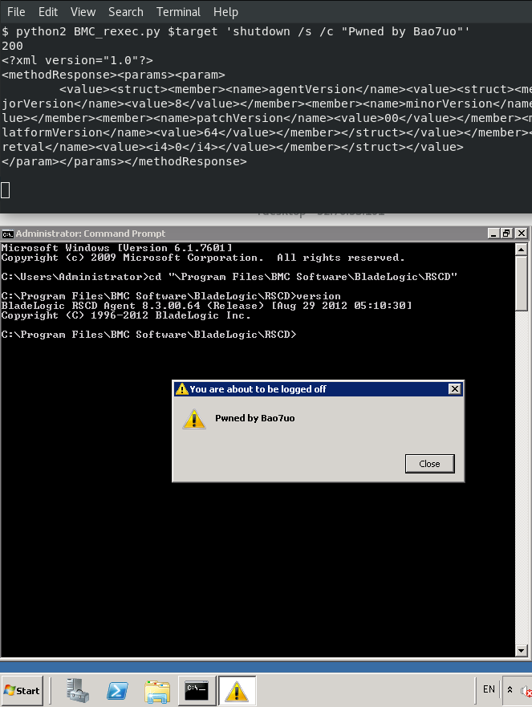
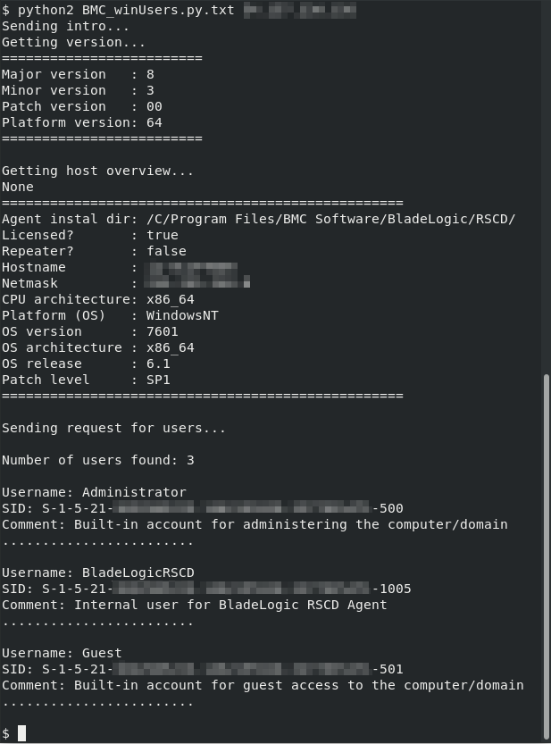

# BMC Bladelogic RSCD remote exploits for Linux and Windows
## Change passwords, List users and Remote code execution
Exploiting vulnerabilities in BMC BladeLogic RSCD agent
- CVE-2016-1542 (BMC-2015-0010)
- CVE-2016-1543 (BMC-2015-0011)
- CVE-2016-5063

## Published on exploit-db
- BMC_rexec.py
    - https://www.exploit-db.com/exploits/43902/
- BMC_winUsers.py
    - https://www.exploit-db.com/exploits/43934/

## BMC_rexec.py Overview

This method of remote execution was achieved by doing my own research - it is performed using XMLRPC and has only been tested against Windows. The script will hang, but the command should execute.

Nick Bloor has a much better execution exploit using a different technique:
- https://github.com/NickstaDB/PoC/tree/master/BMC_RSCD_RCE
- https://nickbloor.co.uk/2018/01/01/rce-with-bmc-server-automation/
- https://nickbloor.co.uk/2018/01/08/improving-the-bmc-rscd-rce-exploit/
- https://www.tenable.com/plugins/index.php?view=single&id=91947

## BMC_winUsers.py Overview

After some research I was able to pull Windows users from the Windows BMC agent over XML RPC, so I adapted the getUsers file from ernw/insinuator to make a Windows version (see the following screenshot). I also modified the ernw/insinuator version to make it a dual platform exploit.

## Credits

My exploits are adapted from https://github.com/ernw/insinuator-snippets/tree/master/bmc_bladelogic
- https://www.insinuator.net/2016/03/bmc-bladelogic-cve-2016-1542-and-cve-2016-1543/

Thanks to Nick Bloor for AWS image for testing.

## Vendor links

- https://docs.bmc.com/docs/ServerAutomation/87/release-notes-and-notices/flashes/notification-of-windows-rscd-agent-vulnerability-in-bmc-server-automation-cve-2016-5063
- https://docs.bmc.com/docs/ServerAutomation/87/release-notes-and-notices/flashes/notification-of-critical-security-issue-in-bmc-server-automation-cve-2016-1542-cve-2016-1543

